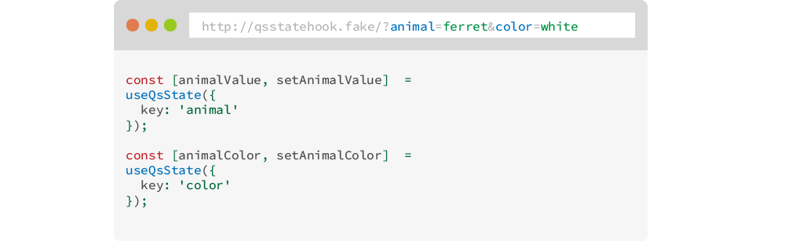
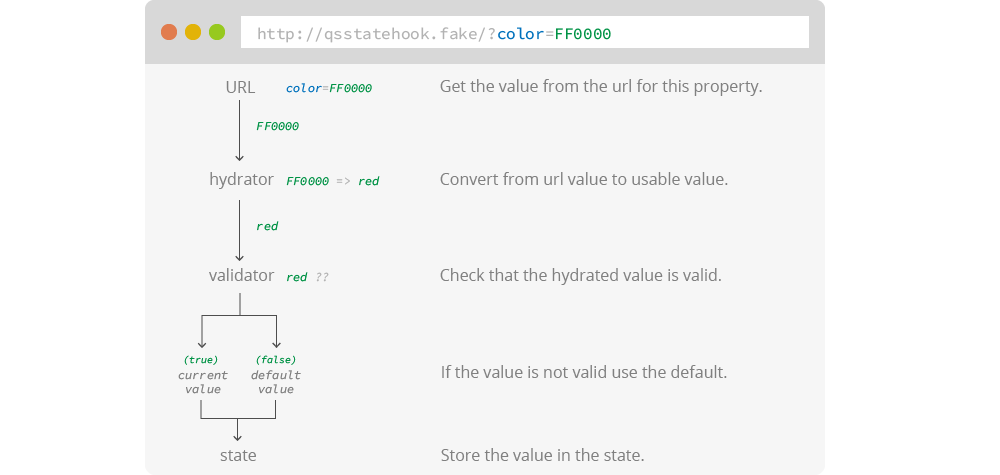
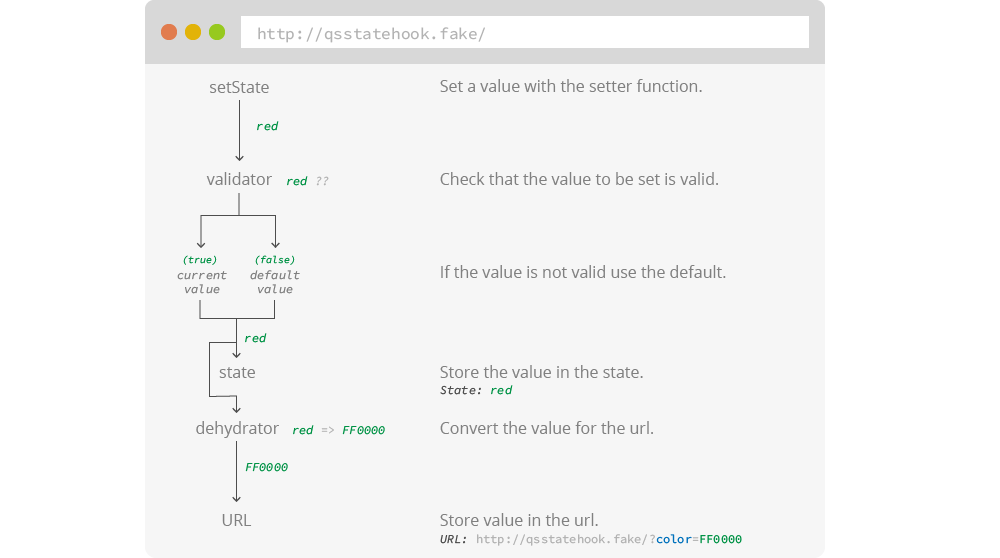

# ?¿ QS State Hook

The QS State Hook allows you to manage component state by storing values in the URL search string.



### Motivation
Certain page state should be shareable. This becomes critical when we're doing data visualizations or want to share the current state of the page we're viewing. Things like order options or filters applied to a data table should be easy to share.
Generating a url from a given state is easy enough but keeping it up-to-date as things change while at the same time being able to respond to url changes becomes more difficult. The QS State Hook aims to solve this problem, making it easy to get and set the url state.

## Getting started

```
yarn add qs-state-hook
- or -
npm install qs-state-hook
```

This is the simplest example of a QS State definition:

```js
import useQsStateCreator from 'qs-state-hook';

const qssDefAnimal = {
  key: 'val',
  default: 'cat'
}

function Component () {
  const useQsState = useQsStateCreator({
    commit: // Commit function.
  });

  const [animal, setAnimal]  = useQsState(qssDefAnimal);
  
  return <p>?¿ QS State Hook</p>;
}
```

Let's break it down:

### useQsStateCreator

```js
const useQsState = useQsStateCreator({
  commit: // Commit function.
});
```
**?¿ QS State Hook is not a routing engine and doesn't do any routing.**
That being said there are a couple of things that are up to you to ensure:
- The component must re-render on every location change. This is needed so QS State can pick up the location change.
- You must provide a function to store the new values in the url. This will depend on the routing engine and how it handles navigation. This is needed because other parts of your app may need to respond to location changes.

The `commit` function will be called with `{search: 'search-string-safe-value'}`;

If you were using `react-router` this would be the approach:
```js
function Component () {
  // react-router function to get the history for navigation.
  const history = useHistory();
  // react-router function to ensure the component re-renders when there is a
  // location change.
  useLocation();

  const useQsState = useQsStateCreator({
    commit: history
  });

  // ... remaining code.
}
```

If you are using `gatsby` things get way simpler, since re-rendering a page on location change is built in:
```js
function Component () {
  const useQsState = useQsStateCreator();

  // ... remaining code.
}
```

### useQsState
Once we have our `useQsState` created, the next step is to define how the actual state is managed.
Each call to `useQsState` should manage a single url value, and you may use it as many times as you like.

**IMPORTANT:**  
The state definition shouldn't change unless its values must be updated. Therefore it should be defined statically outside the component or used with `useMemo`.

The bare minimum QS State configuration is the `key` property which defines how the value is stored in the url, however having a value to default to is useful.
```js
const [animalValue, setAnimalValue]  = useQsState(useMemo(() => ({
  key: 'animal',
  default: 'ferret'
}), []));
```

If the starting url is `http://qsstatehook.fake/?animal=cat` then `animalValue` will start out as `cat` and will default to `ferret` otherwise.

Calling `setAnimalValue` will result in the state and the url being updated.
```js
setAnimalValue('dog');
// Result:
// animalValue = dog
// URL = http://qsstatehook.fake/?animal=dog
```

Many different QS State can be used together:
```js
const [animalValue, setAnimalValue]  = useQsState(useMemo(() => ({
  key: 'animal',
  default: 'ferret'
}), []));

const [animalColor, setAnimalColor]  = useQsState(useMemo(() => ({
  key: 'color',
  default: 'black'
}), []));


setAnimalValue('dog');
setAnimalColor('white');
// Result:
// animalValue = dog
// animalColor = white
// URL = http://qsstatehook.fake/?animal=dog&color=white
```

**Default value:**  
Default values are not added to the url because they are, well, defaults. This results in a cleaner and leaner url.  
With the previous example:
```js
setAnimalValue('ferret');
setAnimalColor('white');
// Result:
// animalValue = ferret
// animalColor = white
// URL = http://qsstatehook.fake/?color=white  <- animal is at default.
```

#### Hydrator and Dehydrator
There are some cases when you need to define how a value is read from the url (hydrated) and how a value is stored in the url (dehydrated).  
A good example of this are numbers. The url is a string and any numbers stored in it will be converted to strings. We may want to convert them back to number before using them.

The `hydrator` property accepts a function to which is passed the url value. If a `falsy` value is returned by the `hydrator`, then the `default` value is used.

```js
const [animalCount, setAnimalCount]  = useQsState(useMemo(() => ({
  key: 'count',
  default: 10,
  hydrator: (v) => {
    // We have to account for the possibility that the value is not on the URL.
    if (v === '') return null;
    // No decimal animals. However would a Chihuahua count as half dog?
    return parseInt(v);
  }
}), []));
```

The `dehydrator` property accepts a function to which is passed the value that was set. Is must return a string value which is used in the url.

```js
const [animalColor, setAnimalColor]  = useQsState(useMemo(() => ({
  key: 'color',
  default: 'blue',
  dehydrator: (v) => {
    // Imaginary function to convert a color name to hex value.
    return fromName2Hex(v);
  },
  hydrator: (v) => {
    // We have to account for the possibility that the value is not on the URL.
    if (v === '') return null;
    // Imaginary function to convert a color hex to name.
    return fromHex2Name(v);
  }
}), []));

setAnimalColor('red');
// Result:
// animalColor = red
// URL = http://qsstatehook.fake/?color=FF0000
```

#### Validator
The validator is used to ensure that the values read from the url and set to it are valid.





The `validator` property accepts an array of valid options or a function for a custom validation:
```js
const [animalValue, setAnimalValue]  = useQsState(useMemo(() => ({
  key: 'animal',
  default: 'ferret',
  validator: (v) => v.startsWith('f')
}), []));

const [animalColor, setAnimalColor]  = useQsState(useMemo(() => ({
  key: 'color',
  default: 'black',
  validator: ['black', 'white', 'brown']
}), []));
```

With these state definitions reading from a url like `http://qsstatehook.fake/?animal=fish&color=blue` would result in:
```js
// animalValue = fish
// animalColor = black
```

While setting the following values:
```js
setAnimalValue('dog');
setAnimalColor('white');

// Result:
// animalValue = ferret
// animalColor = white
// URL = http://qsstatehook.fake/?color=white
```

Since `dog` is not a valid value for `animalValue` it reverts to default and is removed from the URL.

### Advanced
A more advanced usage allows you to use `objects` as a state value. Since `objects` are not easily converted to strings, you'll always have to provide an `hydrator` and `dehydrator`:

```js
const [sortOption, setSortOption]  = useQsState(useMemo(() => ({
  key: 'sort',
  default: {
    field: 'name',
    direction: 'asc'
  },
  dehydrator: (v) => {
    // Let's convert the direction to a number to have a shorter url.
    const dir = v.direction === 'asc' ? 1 : 0;
    return `${v.field}|${dir}`;
  },
  hydrator: (v) => {
    if (!v) return null;
    const pieces = v.split('|');
    return {
      field: pieces[0],
      // Anything that's not a 1 (string because comes from url), is `asc`.
      direction: pieces[1] !== '1' ? 'desc' : 'asc'
    };
  },
  validator: (v) => {
    const { field, direction } = v;
    const validFields = ['name', 'color', 'count'];
    const validDir = ['asc', 'desc'];

    // Validate it has a valid field.
    if (!validFields.includes(field)) return false;
    // Validate it has a valid direction.
    if (!validDir.includes(direction)) return false;

    return true;
  }
}), []));
```

Whenever using objects as a QS State value, they must always be set in its entirety. QS State doesn't do any state merge.  
In the previous example, you'd always have to do:
```js
// ✅ Full state. This is valid.
setSortOption({ field: 'color', direction: 'desc' });

// ❌ Partial state. Not valid.
setSortOption({ field: 'color' });
``` 